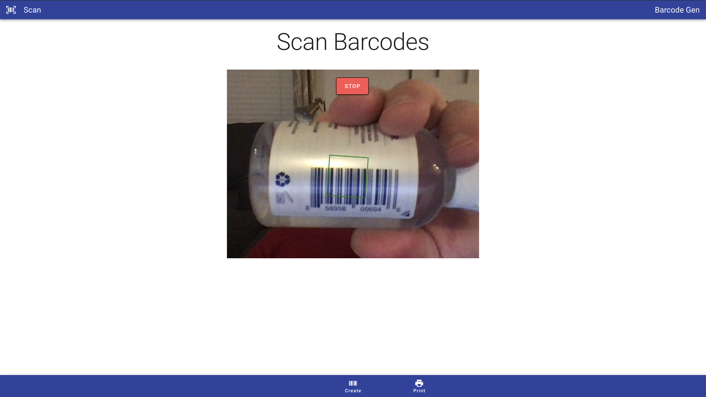

# Barcode Gen

Scan, Create, and Print your very own barcodes. Built for mobile, tablet, desktop and up to 4k screens.

## How it works

Users can Scan or Create their own barcodes from a number of types and specifications. Once saved in the Scan/Create phase, users can head to the Print page for deletion and printing. Validations are provided for user creation on barcode types. 20 Barcode limit, disabled creation and scan on exceeded barcode limit.

## Built with...

* [Vue.js - JS SPA Framework](https://vuejs.org/)
* [Vue Router - Official Vue Router](https://router.vuejs.org/)
* [Vuex - State Management](https://vuex.vuejs.org/)
* [Vuetify - Vue UI Library](https://vuetifyjs.com/en/)
* [Node.js - JS Runtime Environment](https://nodejs.org/en/)
* [Express.js - App Framework for Node.js](https://expressjs.com/)
* [TypeScript - Typed Superset of JS](https://www.typescriptlang.org/)
* [MongoDB - NoSQL Database](https://www.mongodb.com/)

## NPM packages...

* [Quagga - Barcode Scanner](https://www.npmjs.com/package/quagga)
* [Vue-barcode - JS Barcode Library](https://www.npmjs.com/package/vue-barcode)
* [Uuid - Universally Unique Identifier](https://www.npmjs.com/package/uuid)
* [PrintD - Print HTML elements](https://www.npmjs.com/package/printd)
* [CDigit - Collection of check digit algorithms](https://www.npmjs.com/package/cdigit)

## Author

**James Littlefield**
* [Portfolio](https://www.jameslittlefield.net/)
* [LinkedIn](https://www.linkedin.com/in/james-littlefield-93037713b/)

